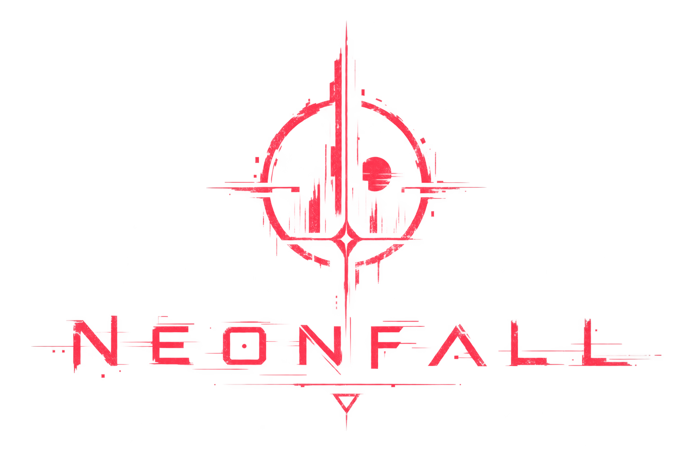

  

Civilization collapsed.

Cities sit empty. Factories still run. Corporate ruins hum under reclaiming green. You're left to explore what's left, rebuild what matters, and figure out what the world became after people stopped being the point.

A game engine and a game, written by hand — no AI — so I can actually understand how game making works. Don't care if it takes months or years. It's mine. Solo. Not accepting PRs.

Daily notes live in [`docs/log/`](docs/log/) (`dd-mm-yyyy`).
